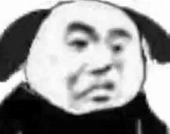
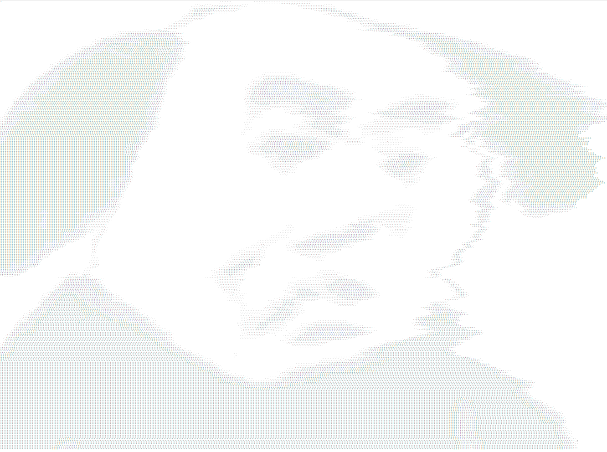
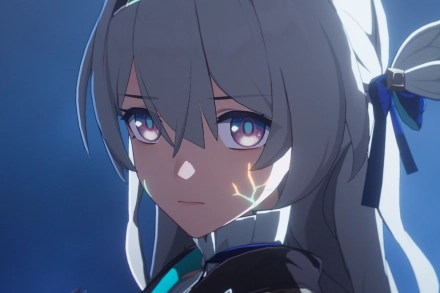
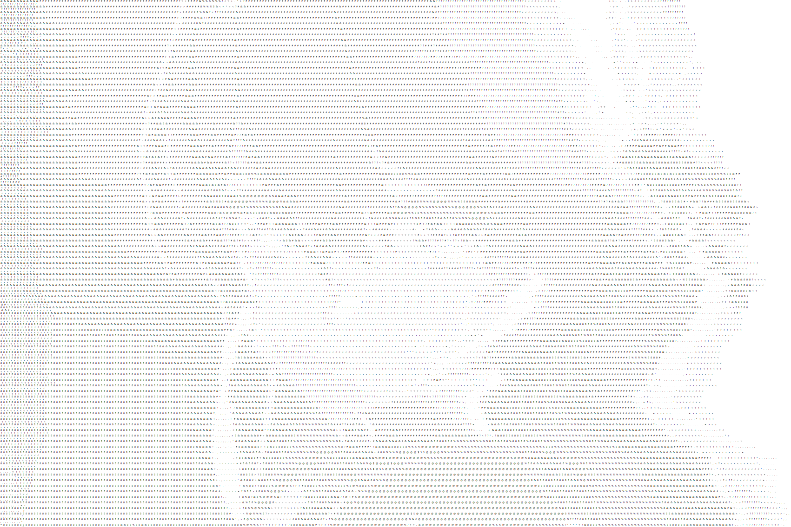

# imageToChars

Software package for converting images into character drawings.

# Install

1. [github](https://github.com/Enl1ghtener/imageToChar)

2. PyPI(coming soon)

# Usage

## Import

```python
import imageToChars
```

## Program Demonstration

<figure class="half">
    
    
</figure>


<figure class="half">
    
    
</figure>

## Code Examples

```python
# All parameters except for the path are not necessary
run(img_path, image_size, horizontal_stretching, longitudinal_stretching)

# Individual adjustments are also supported

# When the parameter 'image_size' is set to 5, image is the original size.
# When the parameter 'image_size' is too large, the image will be distorted
get_new_img(img_path=, image_size)

# Stretch parameter takes 0 to 1
# Images will reduce accuracy in the stretching direction
size_control(img, horizontal_stretching, longitudinal_stretching)

# When the parameter 'print_flag' is set to TURE, the program will directly print the result and will not write
print_chars(img, print_on_terminal, output_file_name)

```

# Requirements

- python3.x

- backage PIL

# Authors

This library is developed and maintained by [Enlightened](https://github.com/Enl1ghtener/imageToChars)

# License

Intervention Image is licensed under the [MIT License](LICENSE).
